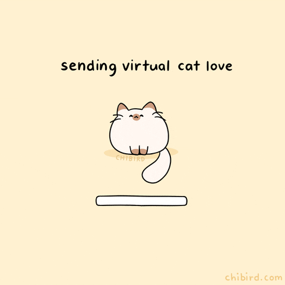
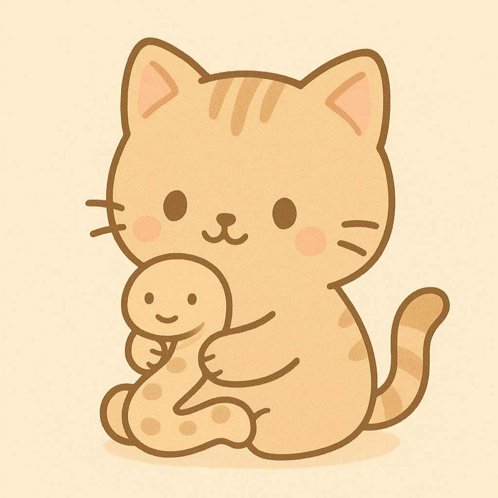
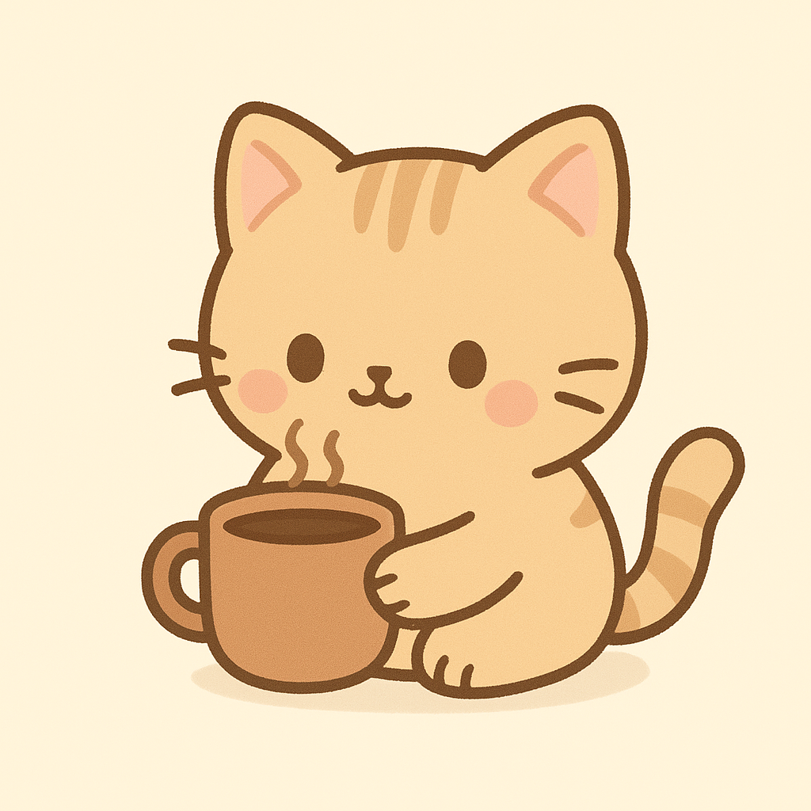
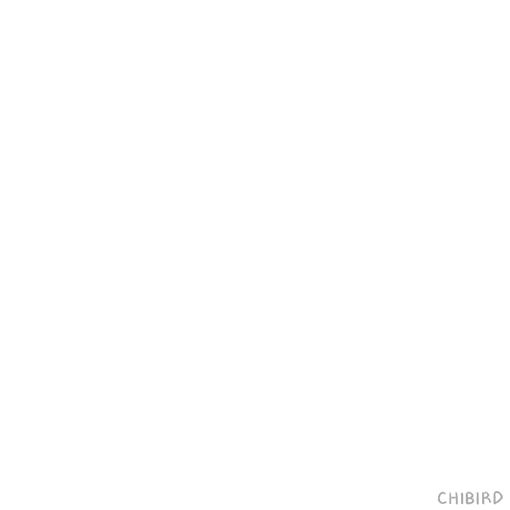

<h1 align="center">🌸 Olá, mundo! Eu sou a Kellen 🌸</h1>

  

💬 Apaixonada por tecnologia, aprendizado constante e por deixar tudo mais bonito (inclusive código!)  
💡 Explorando **Python**, **Java** e **Power BI**, com aquela dose extra de criatividade e bom humor.  
😺 Gatinhos fofos são minha *fuel station* para energia e motivação.  

---

## ✨ Sobre mim
- 🌱 Sempre aprendendo algo novo 
- 📊 Curiosa sobre dados e como eles contam histórias  
- 🐱 Fã declarada de gatinhos  
- 🎯 Buscando unir tecnologia, arte e impacto positivo  

---

## 🛠 Tecnologias que estou estudando

<table>
<tr>
<td align="center">
   
  <b>Python</b> 
  Explorando o básico e intermediário
</td>
<td align="center">
   
  <b>Java</b> 
  Primeiros projetos em andamento
</td>
<td align="center">
   
  <b>Power BI</b> 
  Dashboards criativos
</td>
</tr>
</table>

---

## 💖 Meu jeitinho de programar
> Código limpo + criatividade + persistência = resultado fofo e funcional

  

---

## 🌟 Vamos nos conectar!
- 💼 [LinkedIn](https://www.linkedin.com/in/kellen-silva-b9ba81136/)
- 🐙 [GitHub](https://github.com/KellenCSilva)

---

  <em>Se a vida te der erros no código, abrace um gatinho e tente de novo!</em>

